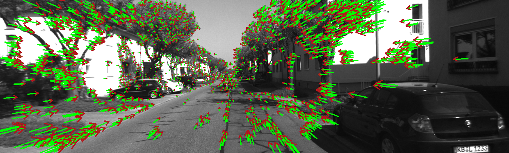
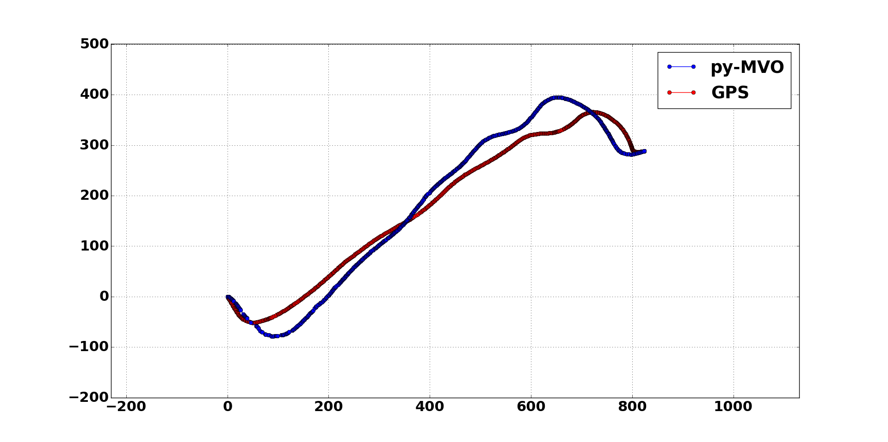

# Py-MVO: Monocular Visual Odometry using Python

The project implements Mononocular Visual Odometry utilizing [OpenCV 3.1.0-dev](https://github.com/opencv/opencv) 
with the [opencv_contrib](https://github.com/opencv/opencv_contrib) modules.

Video:
https://www.youtube.com/watch?v=E8JK19TmTL4&feature=youtu.be


**Optical Flow Field represented by arrows**


**Comparison of py-MVO and a GPS sensor**

## Project

The Python Monocular Visual Odometry (py-MVO) project used the [monoVO-python](https://github.com/uoip/monoVO-python) repository, which is 
a Python implementation of the [mono-vo](https://github.com/avisingh599/mono-vo) repository, as its backbone.
An in depth explanation of the fundamental workings of the algorithm maybe found in [Avi Sinhg's report](http://avisingh599.github.io/assets/ugp2-report.pdf). 
The monoVO-python code was optimized in order to make it more robust, using advance methods in order to obtain a 
higher level of accuracy.This [report]() provides information about the optimizations done to the monoVO-python code. The GPS data in the images EXIF file can also be used to formulate a GPS trajectory in order to compare with the results of Visual Odometry(VO) trajectory. A merge between the GPS and VO trajectories is also possible in order to get an even more reliable motion estimation. The [KITTI](http://www.cvlibs.net/datasets/kitti/eval_odometry.php) dataset was used for testing our methods and new implementations, since they offer accurate camera projection matrices, undistorted images, and reliable ground truth data. 

*The GPS trajectories can only be done with GPS-tagged images(GPS data inside the image's EXIF file).

## Dependencies

These are the dependencies needed for the proper use of py-MVO. The absence of any
of these libraries might cause the code to work inadequately or not work at all.

- [Python 2.7](https://www.python.org/)
- [OpenCV 3.1.0-dev](https://github.com/opencv/opencv) with [opencv_contrib](https://github.com/opencv/opencv_contrib)
- [Numpy](http://www.numpy.org/) 
- [Matplotlib](http://matplotlib.org/)
- [Exifread](https://pypi.python.org/pypi/ExifRead)
- [Haversine](https://pypi.python.org/pypi/haversine)
- [utm](https://pypi.python.org/pypi/utm)

For installation instructions read the [Installation](INSTALLATION.md) file. 

## Usage

In order to run py-MVO, download or clone the repository. Make sure you have all the scripts downloaded/cloned
and in the same directory. The scripts are dependent of each other therefore none can be missing when running the program.

After the dependencies and the py-MVO repository are downloaded you can quickly run any dataset you which. Using the 
Command Prompt(Windows)/Terminal(Linux) change the directory to the directory which contains the repository.
```
$ cd <py-MVO_directory> 
```
Once you are in the directory, run the python command for the MAIN.py with the CameraParams.txt file as argument.
If the CameraParams.txt file is in the directory you can just use the name and extension, e.g. `CameraParams.txt`, if not
provide the entire filepath to it.

*Make sure you have Python as an environmental variable if not the terminal will not recognize the command.

In same directory:
```
$ python MAIN.py CameraParams.txt
```
or

Entire filepath:
```
$ python MAIN.py ../CameraParams.txt
```
The program uses the text file to obtain all the input parameters, the [CameraParams](https://github.com/Transportation-Inspection/visual_odometry/blob/master/src/CameraParams.txt) text file in the repository provides the correct format and should be used as the template, just replace the sample information at the bottom of the file with your information. The image dataset used should be sequential, meaning that the movement between images needs to be progressive; e.g. images taken from a moving vehicle of the road ahead.

Input parameters for the CameraParams Text File:
```
<Image Sequence's Directory> (/ for linux, \ for windows)
<Images' File Format (e.g. PNG, JPG)> (case-sensitive)
<Boolean: Type True if Projection Matrix is used else type None>
<Projection Matrix: is a 3x4 matrix; input as 1-D array, if CameraIntrinsicMat is used: type None>
<CameraIntrinsicMatrix: is a 3x3 matrix; input as 1-D array, if ProjectionMat true: type None>
<Feature Detector: SIFT, FAST, SURF, SHI-TOMASI>
<GPS Flag: List of flags available in CameraParams.txt, if no GPS: type None>
<Ground Truth Poses: a text file with the transformation matrices as 1-D arrays(KITTI dataset format>
<Window Display Flag: List of flags available in the CameraParams.txt>
```
*All the information about the parameters is in the [CameraParams.txt](https://github.com/Transportation-Inspection/visual_odometry/blob/master/CameraParams.txt)

After the text file is set properly run the `python command` mentioned before, the program might take a while depending on the size of the dataset.
When completed, a text file with the translation vectors is saved to `<Image Sequence's Directory>` and a plot of the Visual Odometry's trajectory is presented(depending on the `<Window Display Flag>`).  

*This project has been tested with a dataset of 4,540 images. 

## Sample

In order to run a sample set use the CamParams.txt file as is. All the project folders need to be in the same directory for a succesful run.
Type the following command on the command-line:
```
$ python MAIN.py visual_odometry/CameraParams.txt
```

The images and poses in the KITTI_sample folder belong to the [KITTI Vision Benchmark](http://www.cvlibs.net/datasets/kitti/eval_odometry.php) dataset.

Authors: Andreas Geiger and Philip Lenz and Raquel Urtasun

  

## Calibration and Images

The camera of the dataset needs to be calibrated, the projection matrix or camera instrics matrix must be known. For the best performance of the py-MVO project the images should be undistorted. Undistortion is produced mostly by the lenses in the camera. OpenCV provides more information [here](https://opencv-python-tutroals.readthedocs.io/en/latest/py_tutorials/py_calib3d/py_calibration/py_calibration.html#calibration). 


## License

MIT

## Authors

- Jahdiel Alvarez (jahdiel.alvarez@upr.edu)
- Christoph Mertz


